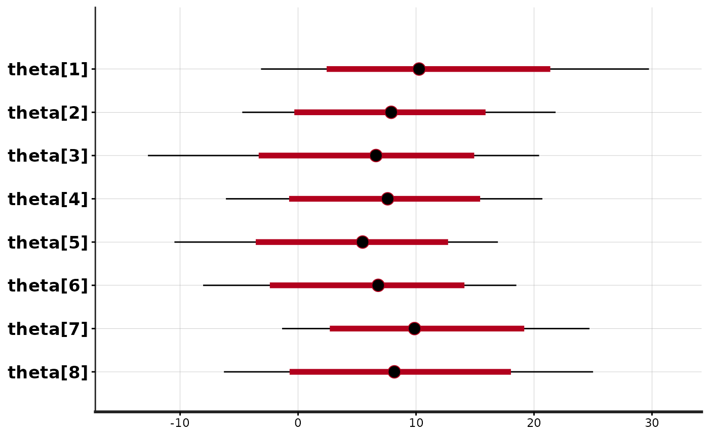
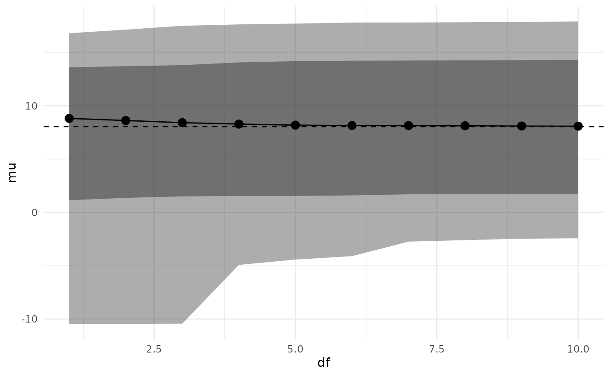
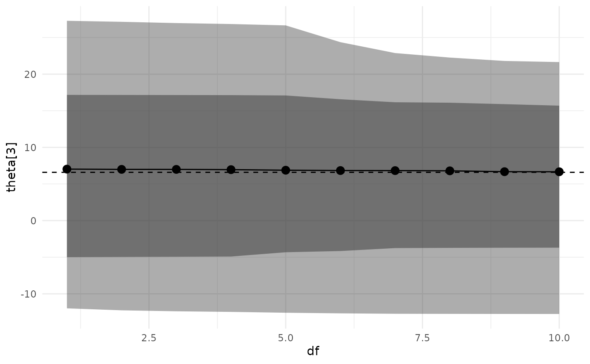

# Sensitivity Analysis of a Simple Hierarchical Model

## Introduction

This vignette walks through the process of performing sensitivity
analysis using the `adjustr` package for the classic introductory
hierarchical model: the “eight schools” meta-analysis from Chapter 5 of
Gelman et al. (2013).

We begin by specifying and fitting the model, which should be familiar
to most users of Stan.

``` r

library(dplyr)
library(rstan)
library(adjustr)

model_code = "
data {
    int<lower=0> J;         // number of schools
    real y[J];              // estimated treatment effects
    real<lower=0> sigma[J]; // standard error of effect estimates
}
parameters {
    real mu;                // population treatment effect
    real<lower=0> tau;      // standard deviation in treatment effects
    vector[J] eta;          // unscaled deviation from mu by school
}
transformed parameters {
    vector[J] theta = mu + tau * eta;        // school treatment effects
}
model {
    eta ~ std_normal();
    y ~ normal(theta, sigma);
}"

model_d = list(J = 8,
               y = c(28,  8, -3,  7, -1,  1, 18, 12),
               sigma = c(15, 10, 16, 11,  9, 11, 10, 18))
eightschools_m = stan(model_code=model_code, chains=2, data=model_d,
                      warmup=500, iter=1000)
```

We plot the original estimates for each of the eight schools.

``` r

plot(eightschools_m, pars="theta")
#> ci_level: 0.8 (80% intervals)
#> outer_level: 0.95 (95% intervals)
```



The model partially pools information, pulling the school-level
treatment effects towards the overall mean.

It is natural to wonder how much these estimates depend on certain
aspects of our model. The individual and school treatment effects are
assumed to follow a normal distribution, and we have used a uniform
prior on the population parameters `mu` and `tau`.

The basic **adjustr** workflow is as follows:

1.  Use `make_spec` to specify the set of alternative model
    specifications you’d like to fit.

2.  Use `adjust_weights` to calculate importance sampling weights which
    approximate the posterior of each alternative specification.

3.  Use `summarize` and `spec_plot` to examine posterior quantities of
    interest for each alternative specification, in order to assess the
    sensitivity of the underlying model.

## Basic Workflow Example

First suppose we want to examine the effect of our choice of uniform
prior on `mu` and `tau`. We begin by specifying an alternative model in
which these parameters have more informative priors. This just requires
passing the `make_spec` function the new sampling statements we’d like
to use. These replace any in the original model (`mu` and `tau` have
implicit improper uniform priors, since the original model does not have
any sampling statements for them).

``` r

spec = make_spec(mu ~ normal(0, 20), tau ~ exponential(5))
print(spec)
#> Sampling specifications:
#> mu ~ normal(0, 20)
#> tau ~ exponential(5)
```

Then we compute importance sampling weights to approximate the posterior
under this alternative model.

``` r

adjusted = adjust_weights(spec, eightschools_m)
```

The `adjust_weights` function returns a data frame containing a summary
of the alternative model and a list-column named `.weights` containing
the importance weights. The last row of the table by default corresponds
to the original model specification. The table also includes the
diagnostic Pareto *k*-value. When this value exceeds 0.7, importance
sampling is unreliable, and by default `adjust_weights` discards weights
with a Pareto *k* above 0.7 (the respective rows in `adjusted` are kept,
but the `weights` column is set to `NA_real_`).

``` r

print(adjusted)
#> # A tibble: 2 × 4
#>   .samp_1            .samp_2              .weights      .pareto_k
#>   <chr>              <chr>                <list>            <dbl>
#> 1 mu ~ normal(0, 20) tau ~ exponential(5) <dbl [1,000]>     0.569
#> 2 <original model>   <original model>     <dbl [1,000]>  -Inf
```

Finally, we can examine how these alternative priors have changed our
posterior inference. We use `summarize` to calculate these under the
alternative model.

``` r

summarize(adjusted, mean(mu), var(mu))
#> # A tibble: 2 × 6
#>   .samp_1            .samp_2             .weights .pareto_k `mean(mu)` `var(mu)`
#>   <chr>              <chr>               <list>       <dbl>      <dbl>     <dbl>
#> 1 mu ~ normal(0, 20) tau ~ exponential(… <dbl>        0.569       7.93      23.7
#> 2 <original model>   <original model>    <dbl>     -Inf           7.98      26.7
```

We see that the more informative priors have pulled the posterior
distribution of `mu` towards zero and made it less variable.

## Multiple Alternative Specifications

What if instead we are concerned about our distributional assumption on
the school treatment effects? We could probe this assumption by fitting
a series of models where `eta` had a Student’s *t* distribution, with
varying degrees of freedom.

The `make_spec` function handles this easily.

``` r

spec = make_spec(eta ~ student_t(df, 0, 1), df=1:10)
print(spec)
#> Sampling specifications:
#> eta ~ student_t(df, 0, 1)
#> 
#> Specification parameters:
#>  df
#>   1
#>   2
#>   3
#>   4
#>   5
#>   6
#>   7
#>   8
#>   9
#>  10
```

Notice how we have parameterized the alternative sampling statement with
a variable `df`, and then provided the values `df` takes in another
argument to `make_spec`.

As before, we compute importance sampling weights to approximate the
posterior under these alternative models. Here, for the purposes of
illustration, we are using `keep_bad=TRUE` to compute weights even when
the Pareto *k* diagnostic value is above 0.7. In practice, the
alternative models should be completely re-fit in Stan.

``` r

adjusted = adjust_weights(spec, eightschools_m, keep_bad=TRUE)
```

Now, `adjusted` has ten rows, one for each alternative model.

``` r

print(adjusted)
#> # A tibble: 11 × 4
#>       df .samp                     .weights      .pareto_k
#>    <int> <chr>                     <list>            <dbl>
#>  1     1 eta ~ student_t(df, 0, 1) <dbl [1,000]>     1.04 
#>  2     2 eta ~ student_t(df, 0, 1) <dbl [1,000]>     0.954
#>  3     3 eta ~ student_t(df, 0, 1) <dbl [1,000]>     0.880
#>  4     4 eta ~ student_t(df, 0, 1) <dbl [1,000]>     0.868
#>  5     5 eta ~ student_t(df, 0, 1) <dbl [1,000]>     0.830
#>  6     6 eta ~ student_t(df, 0, 1) <dbl [1,000]>     0.793
#>  7     7 eta ~ student_t(df, 0, 1) <dbl [1,000]>     0.765
#>  8     8 eta ~ student_t(df, 0, 1) <dbl [1,000]>     0.753
#>  9     9 eta ~ student_t(df, 0, 1) <dbl [1,000]>     0.736
#> 10    10 eta ~ student_t(df, 0, 1) <dbl [1,000]>     0.731
#> 11    NA <original model>          <dbl [1,000]>  -Inf
```

To examine the impact of these model changes, we can plot the posterior
for a quantity of interest versus the degrees of freedom for the *t*
distribution. The package provides the `spec_plot` function which takes
an x-axis specification parameter and a y-axis posterior quantity (which
must evaluate to a single number per posterior draw). The dashed line
shows the posterior median under the original model.

``` r

spec_plot(adjusted, df, mu)
```



``` r

spec_plot(adjusted, df, theta[3])
```



It appears that changing the distribution of `eta`/`theta` from normal
to *t* has a small effect on posterior inferences (although, as noted
above, these inferences are unreliable as *k* \> 0.7).

By default, the function plots an inner 80% credible interval and an
outer 95% credible interval, but these can be changed by the user.

We can also measure the distance between the new and original posterior
marginals by using the special `wasserstein()` function available in
[`summarize()`](https://dplyr.tidyverse.org/reference/summarise.html):

``` r

summarize(adjusted, wasserstein(mu))
#> # A tibble: 11 × 5
#>       df .samp                     .weights      .pareto_k `wasserstein(mu)`
#>    <int> <chr>                     <list>            <dbl>             <dbl>
#>  1     1 eta ~ student_t(df, 0, 1) <dbl [1,000]>     1.04              0.937
#>  2     2 eta ~ student_t(df, 0, 1) <dbl [1,000]>     0.954             0.687
#>  3     3 eta ~ student_t(df, 0, 1) <dbl [1,000]>     0.880             0.524
#>  4     4 eta ~ student_t(df, 0, 1) <dbl [1,000]>     0.868             0.414
#>  5     5 eta ~ student_t(df, 0, 1) <dbl [1,000]>     0.830             0.343
#>  6     6 eta ~ student_t(df, 0, 1) <dbl [1,000]>     0.793             0.273
#>  7     7 eta ~ student_t(df, 0, 1) <dbl [1,000]>     0.765             0.231
#>  8     8 eta ~ student_t(df, 0, 1) <dbl [1,000]>     0.753             0.195
#>  9     9 eta ~ student_t(df, 0, 1) <dbl [1,000]>     0.736             0.166
#> 10    10 eta ~ student_t(df, 0, 1) <dbl [1,000]>     0.731             0.152
#> 11    NA <original model>          <dbl [1,000]>  -Inf                 0
```

As we would expect, the 1-Wasserstein distance decreases as the degrees
of freedom increase. In general, we can compute the *p*-Wasserstein
distance by passing an extra `p` parameter to `wasserstein()`.

### 

Gelman, Andrew, J. B. Carlin, Hal S. Stern, David B. Dunson, Aki
Vehtari, and Donald B. Rubin. 2013. *Bayesian Data Analysis*. 3rd ed.
CRC Press.
